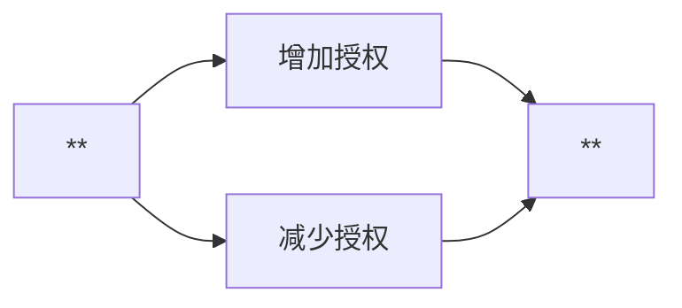
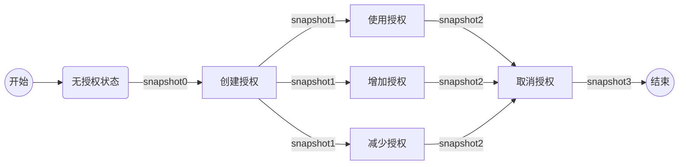
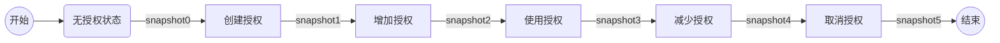

# 授权业务流程

- 业务主流程：


- 附加流程：



---

## 流程嵌套情景

> 将使用，增加，减少的授权操作分为三个流程



> 将使用，增加，减少的授权操作合为一个流程



## 测试命令（以合并的流程进行测试，原因简单）

```bash
snapshot0-5：
    //授权信息查询
    qoscli query approve --from jlgy05 --to jlgy06
    //授权相关账户擦查询
    qoscli query account jlgy05
    qoscli query account jlgy06

1.snapshot0
2.create：
    //创建授权
    qoscli tx create-approve --from jlgy05 --to jlgy06 --coins 1000000qos
3.snapshot1
4.increase：
    //执行增加预授权交易
    qoscli tx increase-approve --from jlgy05 --to jlgy06 --coins 500000qos
5.snapshot2
6.use：
    //执行使用授权交易
    qoscli tx use-approve --coins 500000qos --from jlgy05 --to jlgy06
7.snapshot3
8.decrease
    //执行减少预授权交易
    qoscli tx decrease-approve --from jlgy05 --to jlgy06 --coins 500000qos
9.snapshot4
10.cancel
    //执行取消预授权交易
    qoscli tx cancel-approve --from jlgy05 --to jlgy06
11.snapshot5

```

## 测试结果

> 通过执行测试命令，获取得到所有快照snapshot0-6，比对七个快照内容，验证业务代码是否有问题。

```bash

```
