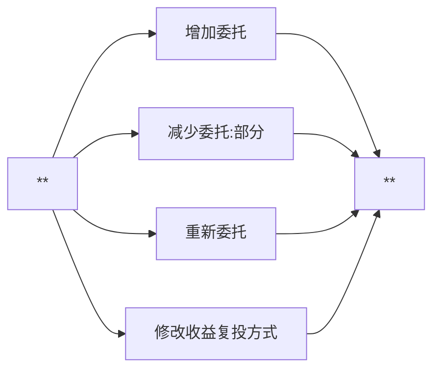
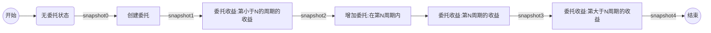
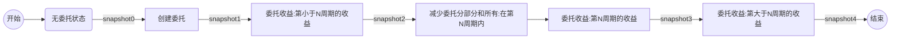
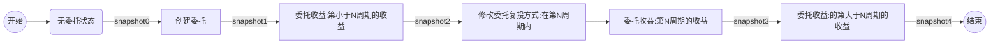

# 委托业务流程

- 委托主流程：


- 附加流程：



---

## 流程嵌套情景

> 增加，减少，重新委托单一操作流程。测试命令可参照各个单独命令的业务场景测试。

- 增加委托



- 减少委托



- 重新委托。
  - 如果是全部重新委托，验证节点A第大于N周期的收益，此时查询不到委托信息。

```mermaid
graph LR
    start((开始)) --> no(无委托状态)
    no --snapshot0--> delegate[创建委托]
    delegate --snapshot1--> income1[委托收益:验证节点A第小于N周期的收益]
    income1 --snapshot2--> redelegate[重新委托部分和所有:在验证节点A的第N周期内]
    redelegate --> income2[委托收益:验证节点A第N周期的收益]
    income2 --snapshot3--> income3[委托收益:验证节点A第大于N周期的收益]
    income3 --snapshot4--> income4[委托收益:验证节点B的第M周期的收益]
    income4 --snapshot5--> over((结束))
```



- 修改委托复投方式



- 以上业务组合操作，组合示例中一个：

```mermaid
graph LR
    start((开始)) --> no(无委托状态)
    no --snapshot0--> delegate[创建委托]
    delegate --snapshot1--> income1[委托收益:验证节点A第小于N周期的收益]
    income1 --snapshot2--> redelegate[重新委托部分:在验证节点A的第N周期内]

    subgraph tx
        redelegate --> increase[增加委托:在验证节点A的第N周期内]
        increase --> decrease[减少委托部分:在验证节点A的第N周期内]
        decrease --> modify[修改委托方式:在验证节点A的第N周期内]
        modify --> income2[委托收益:验证节点A第N周期的收益]
    end

    income2 --snapshot3--> income3[委托收益:验证节点A第大于N周期的收益]
    income3 --snapshot4--> income4[委托收益:验证节点B的第M周期的收益]
    income4 --snapshot5--> over((结束))
```



## 测试命令（以业务组合流程进行测试）

```bash
snapshot0-5:目前测试网络收益发放周期为10个高度，所以查询以下状态最好在连续的三个收益发放收益周期：N-1，N，N+1
    //查询账户、委托信息、验证节点、收益信息
    qoscli query delegations acc0 --indent

    qoscli query account acc0 --indent

    qoscli query validator address1nnvdqefva89xwppzs46vuskckr7klvzk8r5uaa --indent
    qoscli query validator address1f66wr25emjtp5urfcpd02epwg5ply3xzcv2u20 --indent

    qoscli query delegator-income --owner address1nnvdqefva89xwppzs46vuskckr7klvzk8r5uaa --delegator acc0  --indent
    qoscli query delegator-income --owner address1f66wr25emjtp5urfcpd02epwg5ply3xzcv2u20 --delegator acc0  --indent


1.snapshot0
2.delegate[创建委托]
    //执行委托交易
    qoscli tx delegate --owner address1nnvdqefva89xwppzs46vuskckr7klvzk8r5uaa --delegator acc0 --tokens 100000000
3.snapshot1：记录创建委托后的一个状态
4.snapshot2：记录得到第小于N周期的发放收益状态
5.redelegate[重新委托部分:在验证节点A的第N周期内]
    //转委托交易
    qoscli tx redelegate --from-owner address1nnvdqefva89xwppzs46vuskckr7klvzk8r5uaa --to-owner address1f66wr25emjtp5urfcpd02epwg5ply3xzcv2u20 --delegator acc0 --tokens 40000000 --max-gas 200000
6.increase[增加委托:在验证节点A的第N周期内]
    //执行委托交易
    qoscli tx delegate --owner address1nnvdqefva89xwppzs46vuskckr7klvzk8r5uaa --delegator acc0 --tokens 100000000
7.decrease[减少委托部分:在验证节点A的第N周期内]
    //解除委托10000
    qoscli tx unbond --owner address1nnvdqefva89xwppzs46vuskckr7klvzk8r5uaa --delegator acc0 --tokens 60000000
8.modify[修改委托方式:在验证节点A的第N周期内]
    //修改复投方式为true
    qoscli tx modify-compound --owner address1nnvdqefva89xwppzs46vuskckr7klvzk8r5uaa --delegator acc0 --compound
9.snapshot3：记录在发放收益的N周期，执行了各种tx操作，当前周期的收益状态
10.snapshot4：记录在发放收益的第大于N周期收益状态
11.snapshot5：记录转委托的另一个节点在某一收益周期发放收益状态
```

## 测试结果

> 通过执行测试命令，获取得到所有快照snapshot0-5，比对快照内容，验证业务代码是否有问题。

```bash

```
