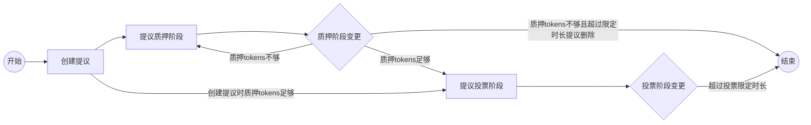
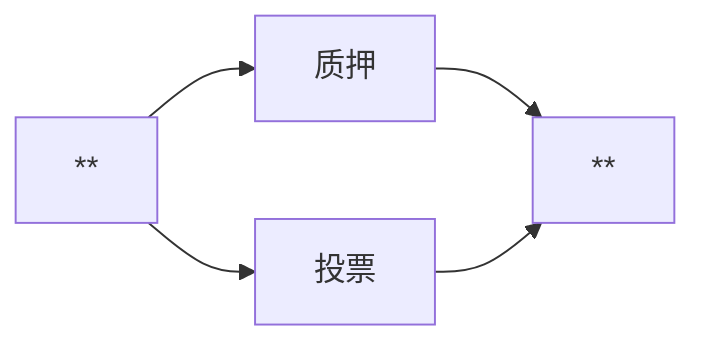
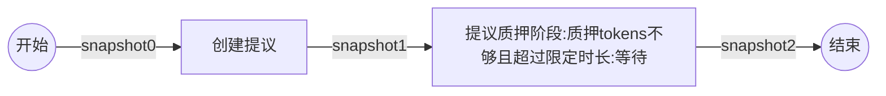
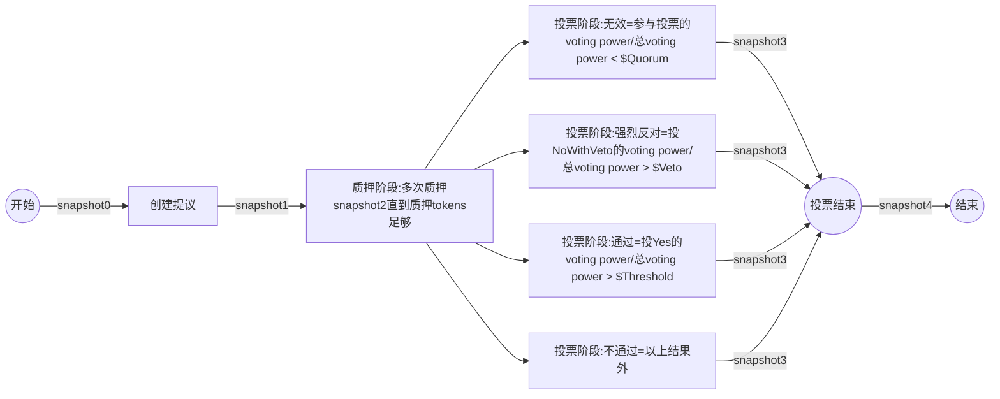

# 提议业务流程

- 提议主流程：



- 附加流程：



---

## 流程嵌套情景

> 从创建提议，然后质押，然后投票，结束。正常流程测试。

- 提议质押tokens不够，且超过质押阶段限定时长。



- 提议质押tokens足够，进入voting阶段，等待voting阶段结束。



## 测试命令（两种嵌套情景测试）

```bash
"-- 提议质押tokens不够，且超过质押阶段限定时长。"
snapshot0-2:
    //查询所有历史提议
    qoscli query proposals --indent
    //验证信息是否正确，阶段
    qoscli query proposal <新增提议的编号> --indent
    //查询质押人信息
    qoscli query account acc0 --indent

1.snapshot0
2.create[创建提议]
    //创建提议
    qoscli tx submit-proposal --title "acc0 proposal" --proposal-type "Text" --proposer acc0 --deposit 40000000 --description "the proposal of acc0"  
3.snapshot1
4.等待时间超过：抵押最大时长
5.snapshot2
```

```bash
"-- 提议质押tokens足够，进入voting阶段，等待voting阶段结束。"
snapshot0-4:
    //查询所有历史提议
    qoscli query proposals --indent
    //验证信息是否正确，阶段
    qoscli query proposal <新增提议的编号> --indent
    //查询提议投票统计
    qoscli query tally <新增提议的编号>
    //查询质押人信息，部分即可
    qoscli query account acc0 --indent
    qoscli query account acc1 --indent
    qoscli query account acc2 --indent

1.snapshot0
2.create[创建提议]
    //创建提议
    qoscli tx submit-proposal --title "acc0 proposal" --proposal-type "Text" --proposer acc0 --deposit 40000000 --description "the proposal of acc0"  
3.snapshot1
4.deposit[质押阶段:多次质押snapshot2直到质押tokens足够]
    qoscli tx deposit --proposal-id <新增提议的编号> --depositor acc0 --amount 20000000
    snapshot2：
    qoscli tx deposit --proposal-id <新增提议的编号> --depositor acc1 --amount 30000000
    snapshot2：
    qoscli tx deposit --proposal-id <新增提议的编号> --depositor acc2 --amount 40000000
    snapshot2：
    ...
5.snapshot2：提议阶段从质押变成voting
6.vote
    //投票
    qoscli tx vote --proposal-id <新增提议的编号> --voter acc0 --option yes
    qoscli tx vote --proposal-id <新增提议的编号> --voter acc0 --option no
    qoscli tx vote --proposal-id <新增提议的编号> --voter acc0 --option abstain
    qoscli tx vote --proposal-id <新增提议的编号> --voter acc0 --option nowithveto
7.snapshot3
8.等待超时：voting阶段的时长，投票结束
9.snapshot4
```

## 测试结果

> 通过执行测试命令，获取得到所有快照，比对快照内容，验证业务代码是否有问题。

```bash

```
