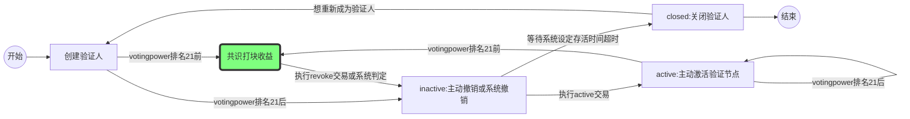
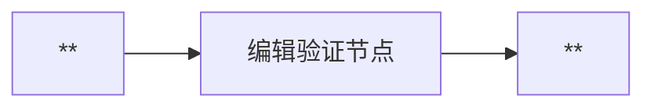
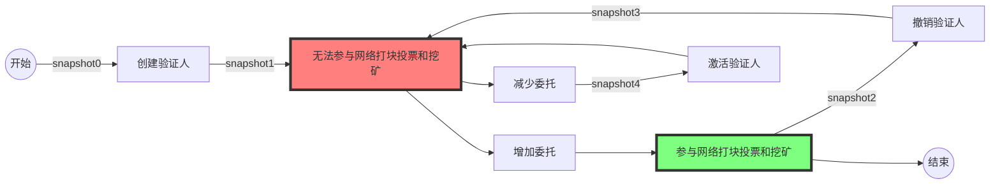

# 验证节点业务流程

- 验证节点主流程：



- 附加流程：



---

## 流程嵌套情景

> CASE ONE：创建验证人排名21内，参与网络打块、投票和挖矿，查看与节点相关委托账户收益；持续运行一段时间；执行revoke交易撤销验证节点，等待系统设定存活时间超时，节点关闭，查询tokens返还。

```mermaid
graph LR
    start((开始)) --snapshot0--> create[创建验证人]
    create --snapshot1--> income1[参与网络打块投票和挖矿]
    income1 --snapshot2--> modify[编辑验证人]
    modify --snapshot3--> revoke[撤销验证人]
    revoke --snapshot4--> income2[无法参与网络打块投票和挖矿]
    income2 --> wait[等待系统设定存活时间超时]
    wait --> closed[节点关闭]
    closed --snapshot5--> over((结束))

    style income1 fill:#0f0,stroke:#333,stroke-width:4px,fill-opacity:0.5
    style income2 fill:#f00,stroke:#333,stroke-width:4px,fill-opacity:0.5
```



> CASE TWO：创建验证人排名21外，无法参与网络打块、投票和挖矿。增加委托tokens，进入排名21内；
> 持续运行一段时间；
> 执行revoke交易撤销验证节点，节点为inactive状态，减少委托，使其排名21外；
> 执行active交易后，仍然无法参与网络打块、投票和挖矿，增加委托tokens，进入排名21内，参与网络打块、投票和挖矿，查看与节点相关委托账户收益。



## 测试命令（两种场景）

- CASE ONE

```bash
snapshot0-5:
    //查询验证人状态信息
    qoscli query validator acc0 --indent

    //查询节点创建人和委托人账户余额信息
    qoscli query account acc0 --indent
    qoscli query account acc1 --indent
    qoscli query account acc2 --indent


1.snapshot0
2.create[创建验证人]:tokens的数量需要在排名21内
    qoscli tx create-validator --moniker "acc0-node" --owner acc0 --tokens 2000000000
    账户acc1、acc2进行委托
3.snapshot1：验证是否创建成功
4.snapshot2：验证是否参与挖矿，获取到收益。
5.modify[编辑验证人]：
    qoscli tx modify-validator --moniker "acc0-node-new" --owner acc0 --logo "http://pic32.nipic.com/20130813/3347542_160503703000_2.jpg" --website "https://github.com/" --details "acc0-node new version"
6.snapshot3：验证编辑后信息是否更新，验证是否挖矿，收益是否与编辑前一致
7.revoke[撤销验证人]：
    qoscli tx revoke-validator --owner acc0
8.snapshot4:验证revoke后，节点的状态，创建人和委托人账户不会获取挖矿收益
9.wait：等待inactive状态在系统设定存活时间超时
10.snapshot5：验证节点关闭后，节点绑定的tokens返还情况。
```

- CASE TWO

```bash
snapshot0-5:
    //查询验证人状态信息
    qoscli query validator acc0 --indent

    //查询节点创建人和委托人账户余额信息
    qoscli query account acc0 --indent
    qoscli query account acc1 --indent
    qoscli query account acc2 --indent

1.snapshot0
2.create[创建验证人]:tokens的数量需要在排名21外
    qoscli tx create-validator --moniker "acc0-node" --owner acc0 --tokens 1000000000
3.snapshot1
4.increase[增加委托]：
    //账户acc1、acc2进行多次委托，提高acc0创建的验证人的绑定tokens
    qoscli tx delegate --owner acc0 --delegator acc1 --tokens 1000000000
    qoscli tx delegate --owner acc0 --delegator acc2 --tokens 1000000000
5.snapshot2
6.revoke[撤销验证人]：主动撤销或委托人解绑tokens
    qoscli tx revoke-validator --owner acc0
7.snapshot3
8.decrease[减少委托]
    //账户acc1、acc2进行解绑，减少acc0创建的验证人的绑定tokens
    qoscli tx unbond --owner acc0 --delegator acc1 --tokens 1000000000
    qoscli tx unbond --owner acc0 --delegator acc2 --tokens 1000000000
9.snapshot4
10.active[激活验证人]
    qoscli tx active-validator --owner acc0
11.snapshot5
12.increase[增加委托]
    //账户acc1、acc2进行多次委托，提高acc0创建的验证人的绑定tokens
    qoscli tx delegate --owner acc0 --delegator acc1 --tokens 1000000000
    qoscli tx delegate --owner acc0 --delegator acc2 --tokens 1000000000
13.snapshot2

```

## 测试结果

> 通过执行测试命令，获取得到所有快照，比对快照内容，验证业务代码是否有问题。

```bash

```
